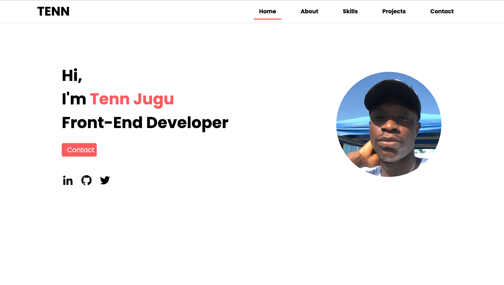
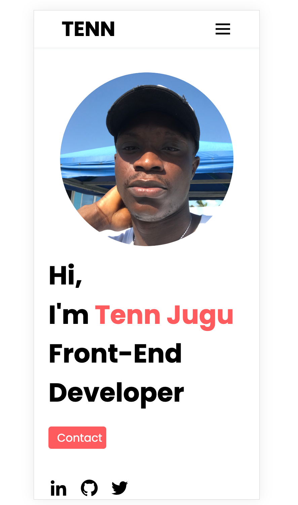

# My Portfolio

Welcome to my portfolio! This project showcases my skills and projects, giving you a glimpse of what I've been working on.

## Table of Contents

- [Introduction](#my-portfolio)
- [Preview](#preview)
- [Technologies](#technologies)
- [Contact](#contact)
- [Projects](#projects)
- [Credits](#credits)

## Preview

**Live Version:** [My Portfolio](https://tennjugu.github.io/My_Portfolio/)

## Technologies

- HTML
- CSS
- JavaScript

## Contact

You can reach me through the following channels:

- [LinkedIn](https://www.linkedin.com/in/teneratjugu)
- [Twitter](https://twitter.com/tenn_jugu)
- [GitHub](https://github.com/tennjugu)
- [Email](jugutenn@gmail.com)

## Projects

Here are some of the projects I have worked on:

1. [TOP movies](https://github.com/tennjugu/Capstone-project-II)
2. [To-do List App](https://github.com/tennjugu/To-do-List)
3. [Weather App](https://github.com/tennjugu/Weather_App)
4. [Restaurant Page](https://github.com/tennjugu/Restaurant-Page)

## Credits

Special thanks to [AVS1508](https://github.com/AVS1508) for the GitHub profile inspiration. Click [here](https://people.umass.edu/avsingh/) for the live version.
